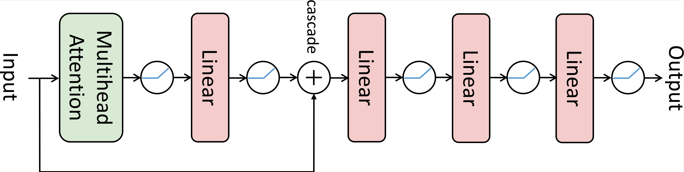

# ReinWiFi

A reninfocement-learning-based application-layer QoS optimization framework of WiFi Networks.

## Introduction

This is the code repository for the ReinWiFi project. The project aims to optimize the application-layer QoS of WiFi networks using Reinforcement Learning (RL) techniques. The project is developed in Python and uses the [PyTorch](https://pytorch.org/) library for the RL implementation. The project is still in its early stages and is under development.

The controller is specifically designed to handle the application-layer QoS of the WiFi network as following shows.


## Usage

### Setup

The communication setup following two steps:

1. Compile the [wlsops-hack](https://github.com/lasso-sustech/wlsops-hack) with respect to different NIC (Note: special kernel driver might be a requirement).
2. Compile the transmission program in [stream-replay](https://github.com/lasso-sustech/stream-replay) in a release mode.
3. Set up the function call handler following the guid in [cluster-tap](https://github.com/lasso-sustech/cluster-tap).

### Examples

Online Testing for proposed model:

```bash
python main.py --config config/modelTest.yaml
```

Offline Training for proposed model for imitator and controller, repspectively:

```bash
python3 offline_trainning.py --config config/trainHisEnv.yaml
python3 offline_trainning.py --config config/trainHisCtl.yaml
```

Online Training for controller:

```bash
python main.py --config config/modelTrain.yaml
```

## TODO List

- [ ] Update README.md
- [ ] Installation guide, with requirements and scripts provided.
- [ ] Code Cleanup

## Acknowledgement

This project is build on top of the [stream-replay](https://github.com/lasso-sustech/stream-replay), [cluster-tap](https://github.com/lasso-sustech/cluster-tap) and [wlsops-hack](https://github.com/lasso-sustech/wlsops-hack). Special thanks to the authors of these projects.
